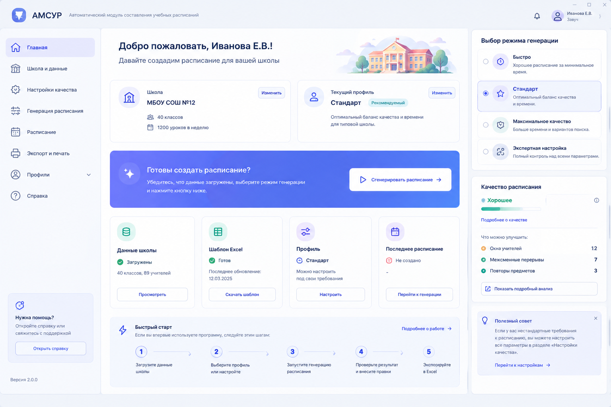

# АМСУР — автоматическое составление школьного расписания

Бесплатное опенсорс-приложение для завуча белорусской школы:
ввод нагрузки → «Сгенерировать» → Top-5 вариантов с объяснением →
ручная правка → выгрузка в Excel.



Стек: .NET 10, WPF, SQLite (raw Microsoft.Data.Sqlite, без EF),
OR-Tools CP-SAT + собственный локальный поиск (Greedy + CompactRepair + VND + LNS).

## Как запустить

```powershell
dotnet build src/Amsur.slnx
dotnet test src/Amsur.Tests   # ~3 мин
# затем запустить src/Amsur.Wpf (или открыть Amsur.slnx в Visual Studio / Rider)
```

Шаблон нагрузки скачивается из самой программы (главный экран → шаблон Excel).
Демо-данные: `DemoSchool.xlsx` (56 строк). Эталон типовой школы: `RealSchool_Schedule_EPICJ.xlsx`.

## Честные ограничения

- Показываем **лучшее найденное** расписание, никогда «оптимальное» (поиск ограничен временем).
- СанПиН-нормы в движке — **требуют сверки с НПА** (бейдж NEEDS-CHECK, см. `SANPIN_RB.md`).
- Таймаут генерации ≠ «невозможно»: статусы «не найдено за время» / «остановлено, лучшее сохранено».

## Документы

- `PROJECT_STATUS.md` — статус, тесты, настройка (единый файл состояния).
- `MASTER_PLAN.md`, `DECISIONS.md`, `BENCHMARKS.md` — план, журнал решений, замеры.
- `SANPIN_RB.md`, `SUBJECTS_RB.md` — нормы и предметы РБ (рабочие выборки, NEEDS-CHECK).
- `WORK_LOG.md` — журнал работ. `Docs_Contest/` — материалы к конкурсам.
- `КАК_ЗАПУСТИТЬ_НА_ЧУЖОМ_ПК.md` — запуск вне dev-машины.

## Лицензия

MIT — см. `LICENSE`.
